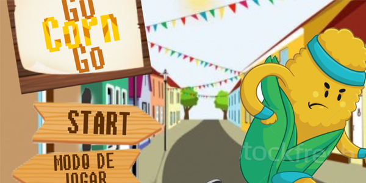
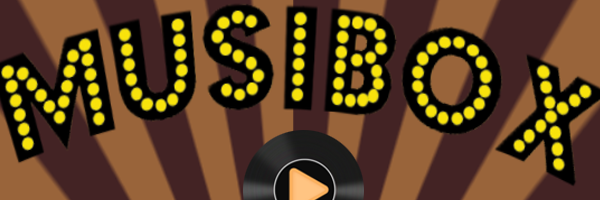

&emsp; &emsp; &emsp; &emsp; &emsp; &emsp; &emsp; &emsp; &emsp; &emsp; &emsp; &emsp; &emsp; &ensp;   
 
&emsp; &emsp; &emsp; &emsp; &emsp; &emsp; &emsp; &emsp; &emsp; &emsp; &emsp; &emsp; &emsp; &emsp; &ensp; &ensp; **JADSAMIA MEDEIROS**
 
&emsp; &emsp; &emsp; &emsp; &emsp; &emsp; &emsp; &emsp; &emsp; &emsp; &emsp; &emsp; &emsp; &ensp; &emsp; &emsp;  _Curso Jogos Digitais
 
&emsp; &emsp; &emsp; &emsp; &emsp; &emsp; &emsp; &emsp; &emsp; &emsp; &emsp; &emsp; &emsp; &emsp; &emsp; &ensp; &emsp; &nbsp; &nbsp;17 anos
 
&emsp; &emsp; &emsp; &emsp; &emsp; &emsp; &emsp; &emsp; &emsp; &emsp; &emsp; &emsp; &emsp; &emsp; &ensp; &ensp;  &emsp; &emsp;  Natal/RN
 
&emsp; &emsp; &emsp; &emsp; &emsp; &emsp; &emsp; &emsp; &emsp; &emsp; &emsp; &emsp; &emsp; &emsp; &emsp; &emsp; &ensp; Gosto de café, paçoca, de assistir desenhos e séries_
 
 
 
# Sobre
                           Sou aluna do IFRN-Ceará-Mirim, atualmente estou no 3° ano
                              cursando o técnico em Programação de Jogos Digitais

* * *
#  Jogos

* * *
1. ## Go Corn Go
 &emsp; &emsp;   
* **SOBRE O JOGO**
 
_Esse foi o primeiro jogo da máteria de oficina e nele retrata um milho que tenta fugir de ser comido em plena festa de São João. O jogo é em plataforma e possui 2 fases._
 
 
2. ## Musibox
 &emsp; &emsp;   
* **SOBRE O JOGO**
 
_Esse foi o segundo jogo da máteria de oficina com o tema relacionado a mensagem, no jogo resgata a cultura do jokebox onde o jogador terá que adivinha a cada fase 2 ritmos aleatórios _
 
 
3. ## Random Quiz
 &emsp; &emsp;   
* **SOBRE O JOGO**
 
_Esse foi o terceiro jogo da máteria de oficina, onde o jogo brinca com o seu nivél básico de conhecimento com perguntas e pegadinhas de assuntos diversos_

* * *
# Mapa de Influência
### este é um mapa que contem artes que me influenciam ao fazer as artes dos jogos ou no desenvolvimento do proprio jogo
  
 
 
 
&emsp; &emsp; &emsp;    
  
 $ jekyll new . --force 
 
  

