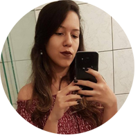

#&nbsp; é espaço
&emsp; &emsp; &emsp; &emsp; &emsp; &emsp; &emsp; &emsp;   
 
&emsp; &emsp; &emsp; &emsp; &emsp; &emsp; &emsp; &emsp; &emsp; &emsp; &emsp; &emsp; &emsp; &emsp; &ensp; &ensp; **JADSAMIA MEDEIROS**
 
&emsp; &emsp; &emsp; &emsp; &emsp; &emsp; &emsp; &emsp; &emsp; &emsp; &emsp; &emsp; &emsp; &ensp; &emsp; &emsp;  _Curso Jogos Digitais
 
&emsp; &emsp; &emsp; &emsp; &emsp; &emsp; &emsp; &emsp; &emsp; &emsp; &emsp; &emsp; &emsp; &emsp; &emsp; &ensp; &emsp; &ensp; &nbsp; 17 anos
 
&emsp; &emsp; &emsp; &emsp; &emsp; &emsp; &emsp; &emsp; &emsp; &emsp; &emsp; &emsp; &emsp; &emsp; &ensp; &ensp;  &emsp; &emsp;  Natal/RN
 
&emsp; &emsp; &emsp; &emsp; &emsp; &emsp; &emsp; &emsp; &emsp; &emsp; &emsp; &emsp; &emsp; &emsp; &emsp; &emsp; &emsp; Gosto de caf_
# Sobre
 _Sou aluna do IFRN-CM, atualmente cursando porgramação de jogos digitais, estou no 3º ano_

* * *
#  JOGOS
* * *
## Go
 
  jogo que ratrata de um milho
    
 $ jekyll new . --force 
 
  

